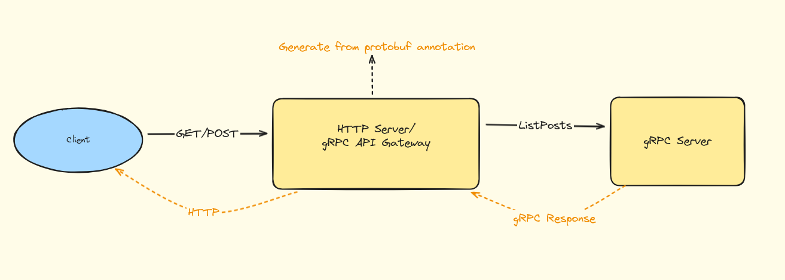
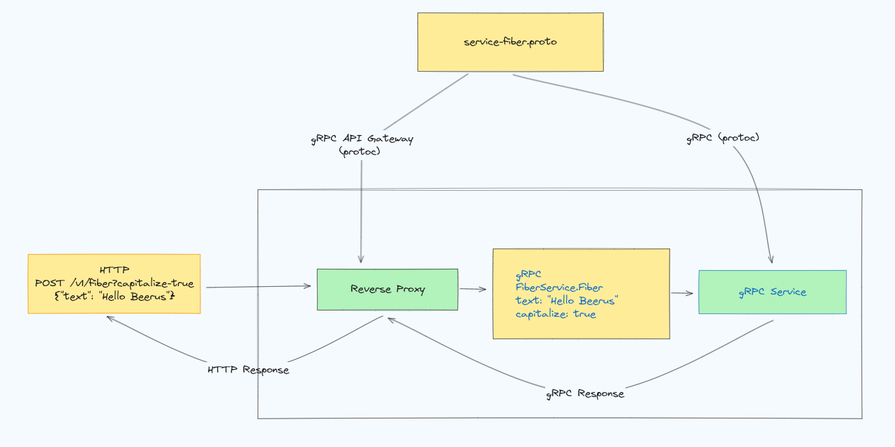

# gRPC Gateway
 
## gRPC Gateway: The Original Bridge
 
At its core, gRPC Gateway generates a reverse-proxy server that translates **RESTful HTTP API** calls into **gRPC requests**. This is accomplished through protocol buffer annotations that define how your gRPC service methods map to RESTful endpoints and JSON structures.
 

 
-----
## Technical Architecture: How It Works
 

 
--------
## Prerequisities
 
### **1. `proto` Compiler**: 
- Follow the installation instructions: https://protobuf.dev/installation/
 
### 2. `buf`
- A helpful tool for working with protoc. Installation instructions are available: https://buf.build/docs/cli/installation/
 
### 3. Go Plugins:
- `Go Proto Plug-in:` Generates Go models from proto files.
- `gRPC Go Proto Plug-in:` Generates Go server and client stubs.
- `gRPC API Gateway Plug-in:` Generates the HTTP reverse proxy.
- `gRPC OpenAPI 3.1 Plug-in (Optional):` Generates OpenAPI documentation.
 
You can install the Go plugins using the following commands:
 
```bash
go install google.golang.org/protobuf/cmd/protoc-gen-go@latest
go install google.golang.org/grpc/cmd/protoc-gen-go-grpc@latest
go install github.com/meshapi/grpc-api-gateway/codegen/cmd/protoc-gen-openapiv3@latest
go install github.com/meshapi/grpc-api-gateway/codegen/cmd/protoc-gen-grpc-api-gateway@latest
```